# MetasploitCoop

基于msf的后渗透协作平台

**郑重声明：文中所涉及的技术、思路和工具仅供以安全为目的的学习交流使用，任何人不得将其用于非法用途以及盈利等目的，否则后果自行承担。**

| 类别 | 说明 |
| ---- | --- |
| 作者 | [Akkuman](https://github.com/akkuman)、[三米前有蕉皮](https://github.com/cn-kali-team) |
| 团队 | [0x727](https://github.com/0x727) 未来一段时间将陆续开源工具 |
| 定位 | 基于 Metasploit Framework 的可视化后渗透协作平台 |
| 语言 | Ruby, Python, Javascript |
| 功能 | 类似于 [CobaltStrike](https://www.cobaltstrike.com/) 的 C2 平台，可视化 [Metasploit Framework](https://www.metasploit.com/) 操作，支持团队协作 |

此仓库只是以下仓库的说明仓库，如果想查看具体的代码请前往以下仓库进行查看

- [MetasploitCoop-Backend](https://github.com/0x727/MetasploitCoop-Backend)
- [MetasploitCoop-Frontend](https://github.com/0x727/MetasploitCoop-Frontend)
- [metasploit-framework](https://github.com/0x727/metasploit-framework)
- [metasploit_data_models](https://github.com/akkuman/metasploit_data_models)

## 什么是 MetasploitCoop ?

红队行动中，大家常常选用 [CobaltStrike](https://www.cobaltstrike.com/) 作为团队的 C2 工具，[MetasploitCoop](https://github.com/0x727/MetasploitCoop) 旨在成为 [CobaltStrike](https://www.cobaltstrike.com/) 的替代品，最大限度地利用 [Metasploit Framework](https://www.metasploit.com/) 的现有生态进行内网渗透。

## 为什么选择 MetasploitCoop ?

### 功能特性

- 可视化的 [Metasploit Framework](https://www.metasploit.com/)
- 右键功能直达
- 支持中转文件夹
- 可视化执行模块
- 一键端口转发、路由添加
- 凭据展示
- [Metasploit Framework](https://www.metasploit.com/) 执行中的任务管理
- 主机列表查看
- 协作聊天
- 主机上模块执行历史记录
- 主机进程管理
- 主机文件管理
- 主机一键截屏
- 可定制化的右键菜单
- 模块说明中文化
- docker重建后的监听恢复
- 原生的 Metasploit Console 支持（多人分离，不污染环境）


还有最最重磅的：

- **理论上支持绝大多数 [Metasploit Framework](https://www.metasploit.com/) 模块，不需要对模块进行任何修改，也就是说，写一个 [Metasploit Framework](https://www.metasploit.com/) 模块就能在 [MetasploitCoop](https://github.com/0x727/MetasploitCoop) 中使用该模块**

## 快速开始体验

### DockerCompose

```bash
$ git clone https://github.com/0x727/MetasploitCoop_0x727.git
$ cd MetasploitCoop
$ sudo docker-compose up -d
```

可以使用 `docker-compose logs` 进行日志查看，当出现如下字样表示启动成功

```
INFO supervisord started with pid 1
INFO spawned: 'homados' with pid 47
INFO spawned: 'msfrpcd' with pid 48
INFO spawned: 'nginx' with pid 49
INFO success: homados entered RUNNING state, process has stayed up for > than 1 seconds (startsecs)
INFO success: msfrpcd entered RUNNING state, process has stayed up for > than 1 seconds (startsecs)
INFO success: nginx entered RUNNING state, process has stayed up for > than 1 seconds (startsecs)
```

#### 环境变量额外说明（可选）

除了 [docker-compose.yml](./docker-compose.yml) 中列出的环境变量，还支持

```shell
TENCENT_TRANSLATE_TOKEN_ID # 腾讯翻译君 api 的 SecretId
TENCENT_TRANSLATE_TOKEN_KEY # 腾讯翻译君 api 的 SecretKey
```

该环境变量加上后可支持 [Metasploit Framework](https://www.metasploit.com/) 模块的实时中文翻译（平台目前内置绝大部分翻译）

## 使用方法

启动 docker 后，打开 [https://127.0.0.1:60443](https://127.0.0.1:60443)，即可进入 [MetasploitCoop](https://github.com/0x727/MetasploitCoop)

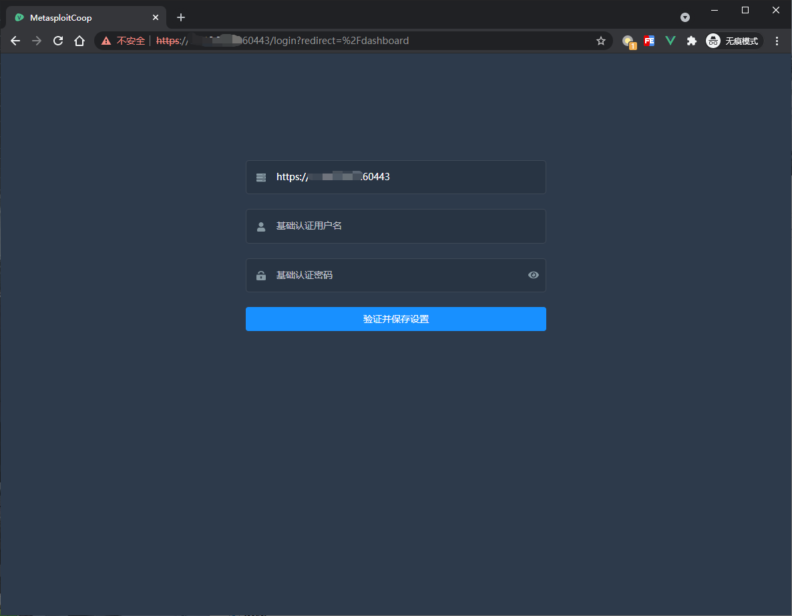

输入msfcoop和DptbHd8R（**默认值**，可以从 [docker-compose.yml](./docker-compose.yml) 中修改）然后保存，即可以进入真正的登录页面

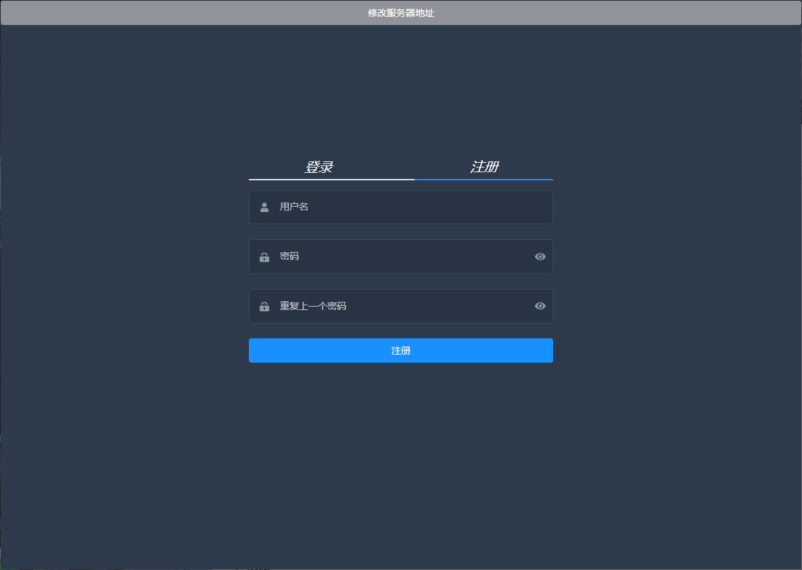

经过注册登录即可，上方的修改服务器地址可以修改真实 c2 服务器的地址，也就是前端可以挂载到其他地方（比如编译成exe），这个此处先不作额外说明

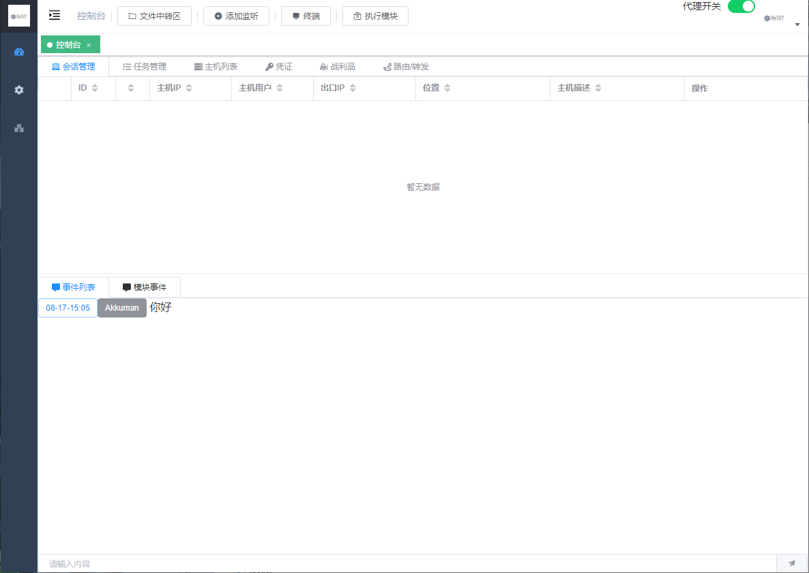

登陆后可在下方给团队成员发送消息

按照一般的流程，我们可以点击上方的 `添加监听` 来添加一个监听任务

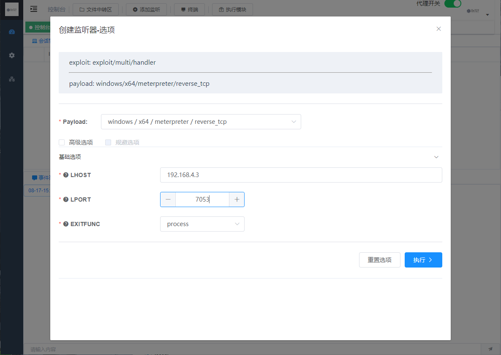

**注意**：此处的端口号需要对应 [docker-compose.yml](./docker-compose.yml) 中的 `7000-7500` 范围，不然无法监听，此处的监听地址不要填写 `0.0.0.0`，因为后面我们根据该监听生成payload的时候需要这个 ip 用来回连。

生成监听任务后，我们可以在任务管理中找到它，右键它可以生成payload

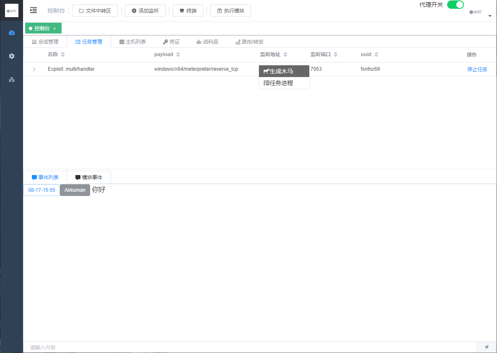

此处我们可以发现还有一个`任务进程` 选项，**该选项主要用在一些模块执行任务上面，在模块未执行完成时观察模块的实时输出**，或者用来结束一些任务。

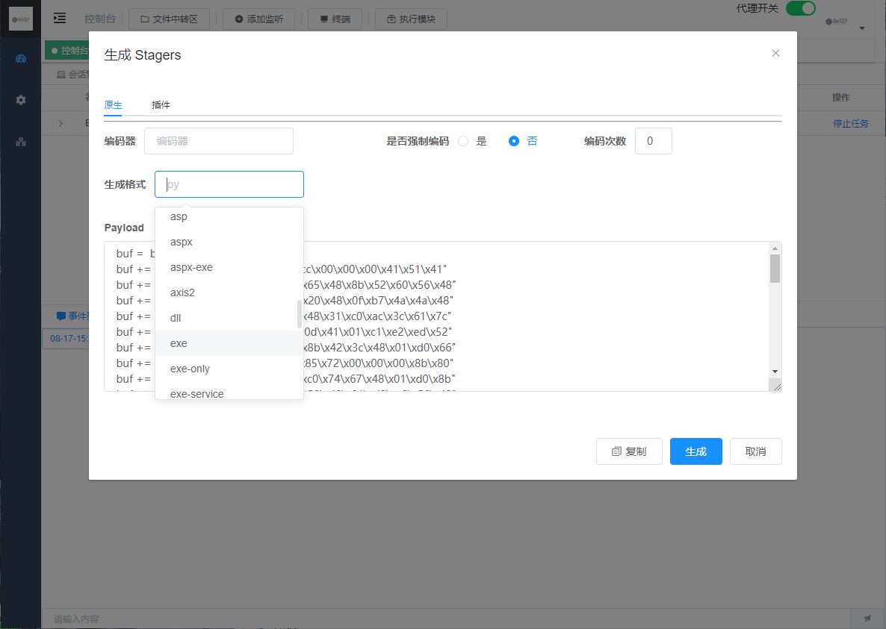

这里一些生成payload的选项和 [Metasploit Framework](https://www.metasploit.com/) 类似，就不再赘述了。

执行上线后会有提示。

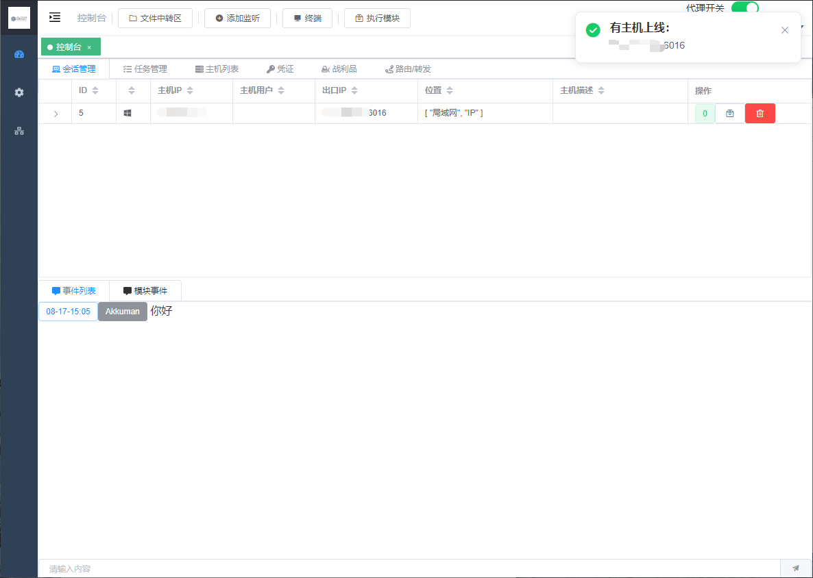

然后我们可以右键查看一下功能，此处的右键快捷功能也可以在平台设置中进行设置

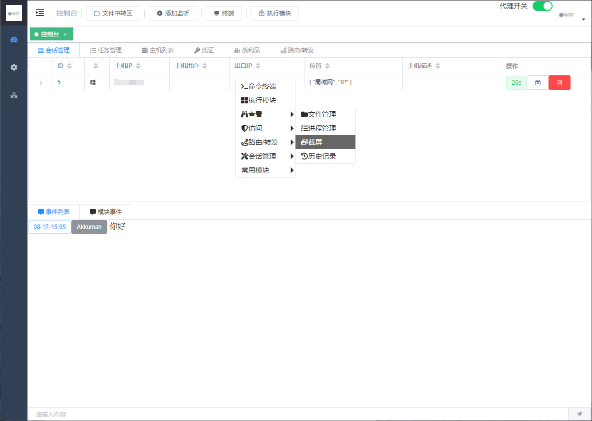

对主机截屏，截屏文件放在文件中转区内，可以通过文件中转区进行查看

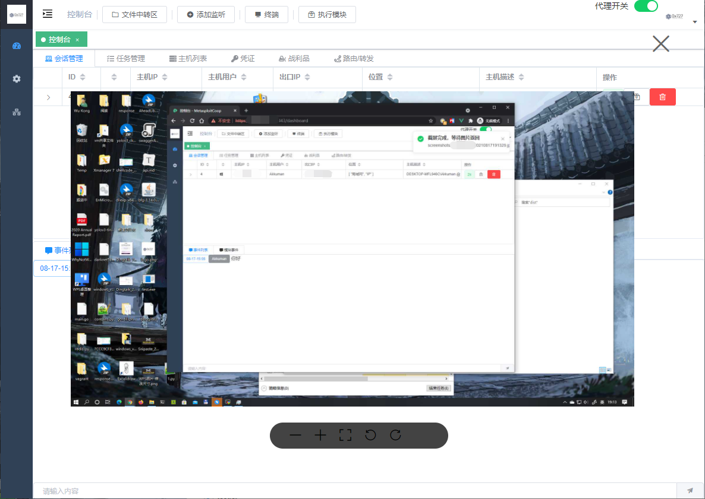

对主机进行进程管理，可以查看对于重要进程会有高亮，此处的高亮列表可以在平台设置中编辑

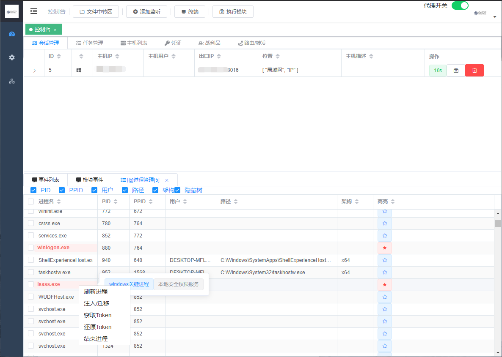

执行模块，可以像msf中一样填写参数，**针对一些参数可以选择文件的，支持直接点击从文件中转区中选择文件**

模块执行完成后会自动回显结果，如果模块迟迟没有回显，可以进入任务管理查看模块执行任务，必要时可以结束掉

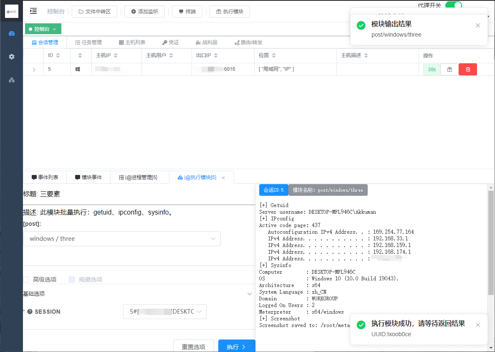

管理后台支持**添加右键自定义菜单、模块翻译管理、进程高亮管理等配置**

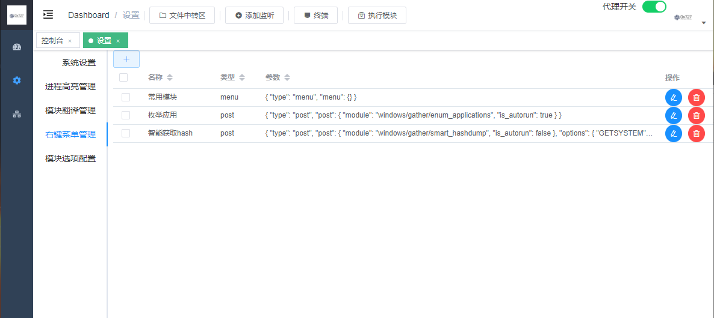

**更多功能等你探索**


## Change Log

### 20201018

1. 文字聊天功能
2. 支持模块执行选项的提示说明
3. 支持会话路由操作支持
4. 支持查询主机历史会话的命令和模块执行记录
5. 截图依据ip存放到不同的目录
6. 支持查阅会话历史记录
7. 会话添加回连（公网）ip端口展示
8. 支持开放或关闭注册功能，增加安全性
9. 支持可配置右键菜单
10. 文件管理支持无限滚动与搜索，防止渲染过多卡死
11. 战利品和凭证列表无限滚动
12. 修正：主机用户名的显示
13. 修正：一些信息列表支持手动拖拽宽度
14. 主机存活状态自动更新
15. 增加 https://github.com/0x727/MetasploitModules_0x727 模块
    1. mssql_powershell: 通过正确的SQL Server口令信息，可启用xp_cmdshell，并获取目标系统session。
    2. clone_user: 创建登录账户，添加该账户到管理员与远程桌面组，并克隆administrator，从而替代clone.exe( 支持尝试提权，默认随机8位密码，用户不能设置Guest，应用RID劫持技术)
    3. redis/unauthorized: 批量扫描Redis未授权漏洞，若存在，探测/root/.ssh/与/var/spool/cron/目录权限，可写入id_rsa.pub到目标服务器（id_rsa.pub应设置绝对路径），或提示Cron反弹命令。
    4. ...更多查看（https://github.com/0x727/MetasploitModules_0x727）
16. 增加内存执行exe的模块(post/windows/manage/execute_pe)（需要exe存在.reloc节，比如golang编译的exe，并且payload与目标主机架构需要相同）
17. 新增模块或选项后自动翻译
18. 重启容器后自动恢复之前的监听
19. 支持客户端使用（目前只支持win，后续将添加其他版本客户端）
20. 支持执行中的任务输出查看

### 20201020

1. 修复 模块历史记录不显示
2. 修复 偶发的终端历史记录解析错误
3. 去除前端的basicauth


## 为 MetasploitCoop 做贡献

MetasploitCoop 是一个免费且开源的项目，我们欢迎任何人为其开发和进步贡献力量。

- 在使用过程中出现任何问题，可以通过 issues 来反馈。
- Bug 的修复可以直接提交 Pull Request 到 dev 分支。
- 如果是增加新的功能特性，请先创建一个 issue 并做简单描述以及大致的实现方法，提议被采纳后，就可以创建一个实现新特性的 Pull Request。
- 欢迎对说明文档做出改善，帮助更多的人使用 ，特别是英文文档。
- 贡献代码请提交 PR 至 dev 分支，master 分支仅用于发布稳定可用版本。
- 如果你有任何其他方面的问题或合作，欢迎发送邮件至 0x727Team@gmail.com 。

> 提醒：和项目相关的问题最好在 issues 中反馈，这样方便其他有类似问题的人可以快速查找解决方法，并且也避免了我们重复回答一些问题。
